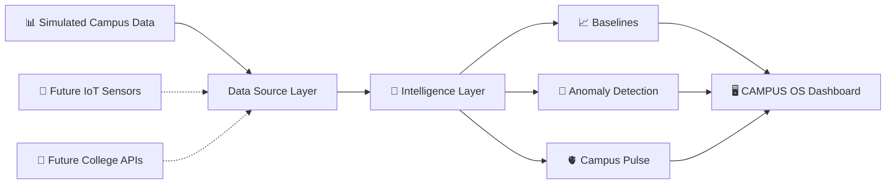

<div align="center">


# CAMPUS OS

### **The intelligence layer for your campus.**

*A living digital model of the college that observes campus activity, detects unusual behaviour, remembers what happened, and helps administrators explore future scenarios.*

<br/>


\

<br/><br/>

<a href="https://mohit20678.github.io/campus-os/">

</a>

<br/><br/>

**HITAM · CSE (AI + ML)**
Built by **Mohit Yogesh Hedau**

</div>

---

## 🧠 What is CAMPUS OS?

Most college software answers:

> **“What happened?”**

CAMPUS OS is being designed to answer:

> **“What is happening, why is it unusual, and what could happen next?”**

CAMPUS OS is a **campus intelligence platform** that models how different parts of a college behave throughout the day.

It connects campus activity into a single operational view — from crowd movement and energy usage to problems and anomalies.

The goal is simple:

**Turn a college from a collection of disconnected systems into one observable, understandable campus.**

---

# ⚡ Why CAMPUS OS?

Traditional college systems are excellent at storing information.

But the campus itself is constantly changing.

| Traditional Systems   | CAMPUS OS                  |
| --------------------- | -------------------------- |
| Attendance records    | Campus activity            |
| Fees & administration | Operational intelligence   |
| Complaint registers   | Recurring problem patterns |
| Static reports        | Live campus pulse          |
| Historical records    | Baseline comparison        |
| Data retrieval        | Anomaly detection          |
| “What happened?”      | “What is unusual?”         |
| Past-focused          | Future-ready               |

### The questions CAMPUS OS is designed to answer

> **Why is Block C packed at 1 PM?**

> **How many rooms are running with AC while barely being used?**

> **Which campus problems keep repeating?**

> **Is today's activity normal for this time and location?**

> **What happens if the campus gets 500 additional students?**

The data may already exist.

**CAMPUS OS is the intelligence layer that connects it.**

---

# 🖥️ Phase 1 — Live

The first working version is already deployed on GitHub Pages.

### Campus Overview

A premium dark dashboard organized around three simple actions:

**OBSERVE → UNDERSTAND → DECIDE**

### 🫀 CAMPUS PULSE

A 0–100 campus health score represented through an animated pulse ring.

It combines six dimensions:

* 👥 Campus Crowd — **25%**
* ⚡ Energy — **20%**
* 🎓 Student Activity — **15%**
* 🛡️ Safety — **15%**
* ⚠️ Problems — **15%**
* 💧 Water — **10%**

---

### 📡 Anomaly Radar

CAMPUS OS compares current activity against what would normally be expected for that:

**Location + Weekday + Hour**

A location becomes an anomaly when observed headcount is **at least 30% above its expected baseline**.

The dashboard shows:

* Expected headcount
* Actual headcount
* Deviation
* Confidence
* Location status

---

### 🗺️ Campus Activity

The prototype models **12 campus locations**:

`Main Gate` · `Administrative Block` · `Block A` · `Block B` · `Block C` · `Central Labs` · `Library` · `Canteen` · `Seminar Hall` · `Sports Ground` · `Hostel` · `Parking`

Locations are classified as:

**Low Activity → Normal → Busy → Crowded**

and sorted by current activity.

---

### 🔄 Simulated Campus Day

The data engine models realistic campus behaviour such as:

* Morning gate rush
* Lunch-time canteen peak
* Quiet weekends
* Hostel activity at night
* Unusual events intentionally planted for anomaly detection

The dashboard refreshes automatically every **5 seconds**.

> **DEMO DATA · SIMULATED**

The prototype clearly labels simulated information rather than presenting it as real sensor data.

---

# 🧩 What is Built vs Planned?

| Capability                        |    Status   |
| --------------------------------- | :---------: |
| Premium dashboard UI              |   ✅ Built   |
| Campus Pulse                      |   ✅ Built   |
| Six campus health metrics         |   ✅ Built   |
| Anomaly Radar                     |   ✅ Built   |
| Expected vs actual activity       |   ✅ Built   |
| 12-location campus model          |   ✅ Built   |
| Simulated campus behaviour engine |   ✅ Built   |
| Auto-refresh dashboard            |   ✅ Built   |
| Central data-source layer         |   ✅ Built   |
| GitHub Pages deployment           |   ✅ Built   |
| Interactive SVG Campus Map        | 🏗️ Planned   |
| Crowd Intelligence Heatmap        | 🏗️ Planned   |
| Campus Memory Timeline            | 🏗️ Planned   |
| Problem Radar                     | 🏗️ Planned   |
| Resource Monitor                  | 🏗️ Planned   |
| What-If Simulator                 | 🏗️ Planned   |
| AI Daily Campus Report            | 🏗️ Planned   |
| Student “Find a Place” mode       | 🏗️ Planned   |
| Supabase + PostgreSQL backend     | 🏗️ Planned   |
| Authentication & roles            | 🏗️ Planned   |
| Waste Detective                   | 🏗️ Planned   |
| Forecasting                       | 🏗️ Planned   |
| PDF Reports                       | 🏗️ Planned   |

---

# 🧠 How CAMPUS OS Thinks

CAMPUS OS currently uses simple, explainable rules instead of pretending to have an AI system that isn't built yet.

### 01 — Establish a Baseline

For every campus location, the system estimates the expected number of people based on:

```text
Location
   +
Weekday
   +
Hour of Day
   ↓
Expected Activity
```

### 02 — Compare Reality Against Normal

```text
Expected Activity
        ↓
     Compare
        ↑
Observed Activity
```

If activity is significantly higher than expected, the system raises an anomaly.

### 03 — Calculate Campus Pulse

The Campus Pulse combines six weighted indicators:

```text
             CAMPUS PULSE
                  │
     ┌────────────┼────────────┐
     ↓            ↓            ↓
   Crowd       Energy       Activity
    25%          20%           15%
     
     ┌────────────┼────────────┐
     ↓            ↓            ↓
  Safety       Problems       Water
    15%           15%           10%
```

### 04 — Future Intelligence

Planned intelligence upgrades include:

* Rolling Z-score anomaly detection
* Isolation Forest
* Seasonal forecasting
* LLM-generated daily reports based **only on computed statistics**

---

# 🏗️ Architecture



### The important design decision

All application data currently passes through:

```text
src/data/dataSource.js
```

That means the prototype does **not** need to be rebuilt from scratch when real data becomes available.

The data source can eventually be replaced with:

```text
Simulated Data
     ↓
IoT Sensors
     ↓
College APIs
     ↓
Supabase
```

while the intelligence and dashboard layers remain largely unchanged.

---

# 🔐 Privacy by Design

CAMPUS OS is designed around **aggregated campus activity**, not individual tracking.

The current model uses:

> **Headcounts per zone**

rather than:

> **Individual student identities or movement histories**

The objective is to understand **how the campus behaves**, not to track individual students.

---

# 🗺️ Product Roadmap

### Phase 1 — Campus Pulse

**Status: ✅ Live**

* [x] Premium operational dashboard
* [x] Campus Pulse
* [x] Activity monitoring
* [x] Anomaly Radar
* [x] Simulated campus data
* [x] Central data-source layer
* [x] GitHub Pages deployment

### Phase 2 — Digital Twin

**Status: 🏗️ Planned**

* [ ] Interactive SVG campus map
* [ ] Click-through building details
* [ ] Crowd intelligence heatmap

### Phase 3 — Campus Memory

**Status: 🏗️ Planned**

* [ ] Full Anomaly Radar
* [ ] Possible-cause explanations
* [ ] Campus Memory timeline
* [ ] Problem Radar
* [ ] Resource Monitor
* [ ] Energy monitoring
* [ ] Water monitoring

### Phase 4 — Simulation & Intelligence

**Status: 🏗️ Planned**

* [ ] What-If Campus Simulator
* [ ] Student population simulation
* [ ] Classroom capacity simulation
* [ ] Canteen demand projection
* [ ] Parking projection
* [ ] Library demand projection
* [ ] Energy demand projection
* [ ] AI daily campus report
* [ ] Student “Find a Place” mode

### Phase 5 — Real Backend

**Status: 🏗️ Planned**

* [ ] Supabase
* [ ] PostgreSQL
* [ ] Authentication
* [ ] Row Level Security
* [ ] Role-based access
* [ ] Persistent campus data

### Phase 6 — Advanced Operations

**Status: 🏗️ Planned**

* [ ] Waste Detective
* [ ] Forecasting
* [ ] PDF reports
* [ ] Presentation mode

---

# 👥 Planned User Roles

| Role                         | Intended Access                |
| ---------------------------- | ------------------------------ |
| 🏛️ Principal / Admin        | Full campus intelligence       |
| 🛠️ Staff / Facility Manager | Resources, problems & alerts   |
| 🎓 Student                   | Find a place & report problems |
| 👀 Demo Viewer               | Read-only access               |

---

# 📸 Dashboard Preview

> Add your real screenshots inside `docs/` as the project evolves.

<div align="center">

**CAMPUS OS — Phase 1 Dashboard**

</div>

---

# 🛠️ Tech Stack

<div align="center">

| Layer           | Technology                |
| --------------- | ------------------------- |
| Frontend        | React 19                  |
| Build Tool      | Vite 8                    |
| Styling         | Tailwind CSS 4            |
| Routing         | React Router / HashRouter |
| Charts          | Recharts                  |
| Deployment      | GitHub Pages              |
| Future Backend  | Supabase                  |
| Future Database | PostgreSQL                |
| Future Map      | SVG                       |

</div>

### Design System

```text
Background    → Near-black graphite
Accent        → Indigo
Status        → Green / Amber / Red / Blue
Headings      → Space Grotesk
Body          → Inter
Numbers       → JetBrains Mono
```

---

# 📁 Project Structure

```text
campus-os/
│
├── public/
│   └── hitam-logo.png
│
├── src/
│   ├── components/
│   │   ├── Layout.jsx
│   │   └── PulseRing.jsx
│   │
│   ├── data/
│   │   ├── buildings.js
│   │   ├── generator.js
│   │   └── dataSource.js
│   │
│   ├── pages/
│   │   ├── Overview.jsx
│   │   └── Placeholder.jsx
│   │
│   ├── nav.js
│   ├── App.jsx
│   ├── main.jsx
│   └── index.css
│
└── package.json
```

---

# 🚀 Run Locally

### 1. Clone the repository

```bash
git clone https://github.com/mohit20678/campus-os.git
```

### 2. Enter the project

```bash
cd campus-os
```

### 3. Install dependencies

```bash
npm install
```

### 4. Start the development server

```bash
npm run dev
```

Open:

```text
http://localhost:5173/campus-os/
```

### Deploy

```bash
npm run deploy
```

---

# 📊 Prototype Data

The current prototype models:

**3,241 students**

across **12 campus locations**.

All values are **simulated** and intentionally labelled as simulated within the application.

This makes the current system a working product prototype without falsely claiming access to real campus sensors or student-tracking infrastructure.

---

# 🧪 Prototype Status

> ### ⚠️ Important
>
> **CAMPUS OS Phase 1 uses simulated data.**
>
> It does **not** currently connect to real IoT sensors, college databases, or student-tracking systems.
>
> The architecture is intentionally designed so that the simulated data layer can later be replaced with real sensors, Supabase, or college APIs.

**Built today:** the operational dashboard, campus simulation, baseline comparison, anomaly detection, Campus Pulse and data-source abstraction.

**Future:** digital twin, persistent backend, forecasting, simulation, resource intelligence and additional AI-assisted features.

---

# 🌱 The Vision

A campus generates enormous amounts of information every day.

People move.

Rooms fill.

Buildings empty.

Energy gets consumed.

Problems repeat.

Events change behaviour.

Yet these signals often remain disconnected.

**CAMPUS OS is an attempt to make the campus itself observable.**

Not another ERP.

Not another attendance system.

Not another dashboard full of disconnected numbers.

A system that can eventually move from:

```text
Observe
   ↓
Understand
   ↓
Remember
   ↓
Simulate
   ↓
Decide
```

**One campus. One operational picture.**

---

# 👨‍💻 Built By

<div align="center">

### Mohit Yogesh Hedau

**CSE (AI + ML) · HITAM**

<a href="https://github.com/mohit20678">

</a>

<br/><br/>

### “Find your path.”

**HITAM**

<br/>

<a href="https://mohit20678.github.io/campus-os/">

</a>

<a href="https://github.com/mohit20678/campus-os">

</a>

</div>

---

<div align="center">

**CAMPUS OS**

*Making the campus observable, understandable, and eventually — simulatable.*

<br/>

⭐ If you find the project interesting, consider starring the repository.

</div>
